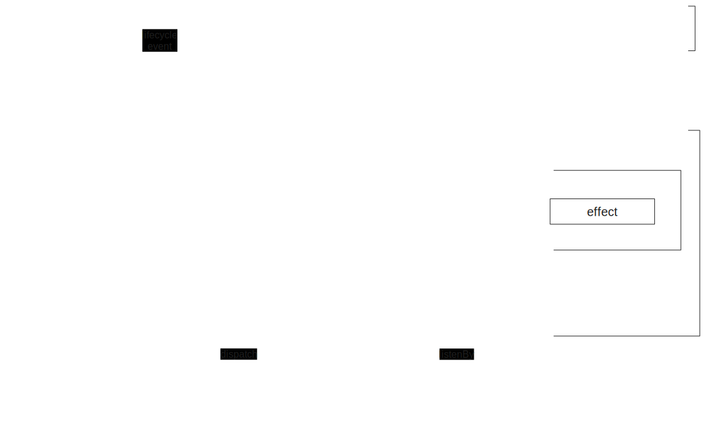

# 状态框架设计

## 背景
前端社区已经存在大量的状态管理库，例如 Redux、MobX、Zustand 等。这些库为前端开发人员提供了强大的工具，可以帮助他们管理应用程序的状态。

但是，长期的实践告诉我，这些库并不为所有的开发者、或者说特定的场景提供足够的灵活性。

比如
1. redux 没有事件机制，没有细粒度的副作用处理方案
2. mobx 侵入性过高
3. zustand 又过于简单

在最近的几个新的项目当中，我尝试着自己创建了一个状态管理框架，并尝试着解决一些问题。

## 目标
设计一个通用、实用、好用的状态管理框架。

## 功能概览


1. 状态模型定义
2.  状态创建、访问（共享状态、实例状态）
3. 输入（动作）、输出（状态、状态流、事件）
4. 状态销毁
5. 副作用管理
6. 调用追踪（日志、可视化）
7. 聚合事件（实例创建、状态更新、实例销毁、事件）
8. 一些设计上的考虑
9. 视图整合

## 模型定义

状态模型定义是生成状态对象的蓝图。它定义了状态对象的结构和行为。
下面是一个基本的状态模型定义示例：
```ts
const createTask = createModel({
    name: "Task", // 用于标识这类状态对象，便于调试
    state: (params) => ({
        // ...对象结构
        name: '',
        startTime: 0,
    }),
    setup: (api, params, context) => {
        // ...对象初始化、内部逻辑（处理输入、更新状态、触发事件）
    }
})
```

## 状态创建、访问
通过 `createModel` 返回的工厂函数可以创建状态实例。

```ts
const task = createTask(params);
```

提供众多的方式应对使用场景，可以通过以下方式访问状态实例的状态。
```ts
task.state.name; // string
task.states.name; // Observable<string>
task.asyncStates.name; // Observable<string>
task.updates.name; // Observable<string>
task.fullState; // Observable<{name: string}>
task.asyncFullState; // Observable<{name: string}>
```

## 输入输出
输入输出并不需要像状态的工厂函数来创建，仅需要在 `createModel` 上使用 ts 类型声明。

```ts
createModel<State, Input, Event>
// State 状态
// Input 输入
// Event 输出
```

```ts
const createTask = createModel<{name:string, startTime:number}, {start: string}, {started: string}>
```

向状态实例内部发送输入数据，**外部**可以通过实例的 dispatch 方法调用。

```ts
task.dispatch.start()
```

状态模型**内部**通过 setup 内的 api.actions 来处理输入，并使用 `api.setState` 更新状态。
```ts
setup(api){
    const { actions } = api;
    actions.start.subscribe((name)=>{
        api.setState({
            name: name
            startTime: Date.now()
        });
    });
}
```

输出包括状态和事件（状态在上节有讲），以下是事件触发和监听的方式。

实例内部使用 `api.emit` 来触发事件。 

```ts
setup(api){
    const { actions } = api;
    actions.start.subscribe((name)=>{
        api.setState({
            name: name,
            startTime: Date.now()
        });

        api.emit.started(name);
    });
}
```

外部通过状态实例的 events 属性来监听事件。

```ts
task.events.started.subscribe((name)=>{
    console.log('started: ', name);
})
```

# 状态实例销毁

状态实例销毁后，会自动销毁所有订阅，阻止输入处理函数运行。
```ts
task.destroy()
```

# 副作用管理
在状态实例销毁的同时运行一些逻辑是很常见的，可以通过 `setup` 函数返回一个清理函数来执行该逻辑。
```ts
setup(api){
    
    return () => {
        // ... cleanup
    }
}
```

此外 `api.effectx` 也用于辅助管理副作用，例如：
```ts
let effectId = effectx.runEffect(()=>{
    // ...
    return () => {
        // ... cleanup
    }
});
effectx.cleanEffect(effectId); // 执行副作用
effectx.popEffect(effectId); // 弹出副作用，但不执行

// 直接挂载 cleanup
effectId = effectx.attachEffect(()=>{
    // ... cleanup
});

// 类似 react useEffect，多次执行，先销毁上一次的副作用
effectx.cycleEffect('nameOfEffect',()=>{
    const t = setInterval(()=>{
        console.log('tick');
    }, 3000);

    return () => clearInterval(t);
});

effectx.clean() // 清除之前所有的副作用
effectx.destroy() // 清除之前所有的副作用，拒绝新的副作用执行
```

# 聚合事件
这是很通用的场景，我们会需要一个截面去完成一些插件逻辑。因此需要有一些聚类事件。
实例创建、状态更新、实例销毁、输入、输出事件。

```ts
const LifecycleEvent = {
    create: Symbol('create'),
    update: Symbol('update'),
    destroy: Symbol('destroy'),
}
createTask.events[LifecycleEvent.create] //  Observable<{instance}>
createTask.events[LifecycleEvent.update] //  Observable<{instance,keys}>
createTask.events[LifecycleEvent.destroy] // Observable<{instance}>

createTask.actions.start
createTask.updates.name
createTask.events.started
```

# 调用追踪（日志、可视化）
有了趁手的工具，我们能够高效地编码，表达业务逻辑，但是也难免会写出错误的逻辑，因此需要有一些工具来帮助我们发现问题。

在以往，一旦线上发现问题，我们都需要花费大量时间调试我们的代码、定位问题，我们没有办法让各种逻辑都收敛（如果可能的话应该如此），对于排查问题而言，我们需要的信息是：
1. 对象在哪里创建的
2. 对象在哪里被更新（或者是谁发送事件导致的更新）
3. 对象在哪里销毁的
4. 一些关键操作消耗的时间是多少

有了上节的聚类事件，我们就能够实现一个简单的日志，或者可视化工具来观察对象间的交互。

# 一些设计上的考虑
> 好的框架会提供一套机制让参与者写出规范的、一致性强的代码、并减少 Bug 的产生

## 封装性
体现在
1. state 只读，仅能在 setup 内部通过 api.setState 更新
2. action 仅能在 setup 内部监听
3. event 仅能通过 setup 内部通过 api.emit 触发

## 响应式机制
`instance.state.xxx` 是不具备响应式的，视图消费却需要有这样的能力。

因此基于 rxjs 提供了响应式的对象，覆盖了
1. 状态整体及局部响应式
3. 状态更新事件
5. 异步消费

# 视图整合

因为状态响应式基于 rxjs，可以安装 `observable-hooks` 来订阅状态。

```tsx
import {useObservableState} from 'observable-hooks';

function SomeComponent(){
    const name = useObservableState(task.states.name)
    return <div>{name}</div>
}
```

# 一个完整的example

实现一个 countdown 的状态模型，并在 react 中使用

```tsx
const CountdownModel = createModel<{
  count: number;
  running: boolean
}, {
  start: number;
  pause: void;
  resume: void;
}, {
  start: number;
  tick: number;
  paused: number;
  timeout: void;
},
  void |
  {
    init?: number;
  }
>({
  name: 'count',
  state: (params) => ({
    running: false,
    count: params?.init || 0,
  }),
  setup(api, params) {
    api.actions.start.pipe(
      switchMap(n => {
        api.emit.start(n);
        api.setState({ count: n, running: true });
        return interval(1000);
      }),
      tap(() => {
        if (!api.state.running) {
          throw 'pause';
        }
        const cnt = api.state.count - 1;
        if (cnt >= 0) {
          api.setState({ count: cnt });
          api.emit.tick(cnt);
        }
        if (cnt <= 0) {
          api.emit.timeout();
          throw 'timeout';
        }
      }),
      retry()
    ).subscribe();

    api.actions.pause.subscribe(() => {
      api.setState({
        running: false
      });
      api.emit.paused(api.state.count);
    });

    api.actions.resume.subscribe(() => {
      api.dispatch.start(api.state.count);
    })
  },
})


export default function TestStateModel() {
  const [cdIns] = useState(() => CountdownModel({
    init: 10
  }));

  const [number, setNumber] = useState(cdIns.state.count)
  const state = useModelState(cdIns)
  useEffect(() => {
    const sub = new Subscription();

    sub.add(cdIns.events.start.subscribe((n) => {
      console.log('start at', n)
    }))

    sub.add(cdIns.events.paused.subscribe((n) => {
      console.log('pause at', n)
    }))

    sub.add(cdIns.events.tick.subscribe((n) => {
      console.log('tick at', n)
    }))

    sub.add(cdIns.events.timeout.subscribe((n) => {
      console.log('timeout')
    }))

    return () => sub.unsubscribe();
  }, [])

  return <div>
    <input type="number" value={number} onChange={e => setNumber(Number(e.target.value))} />
    <button onClick={() => {
      cdIns.dispatch.start(number);
    }}>start</button>
    <button onClick={() => cdIns.dispatch.pause()}>pause</button>
    <button onClick={() => cdIns.dispatch.resume()}>resume</button>
    <button>{state.count}</button>
  </div>;
}
```

# 详细的 API 定义
```ts
interface InnerApi<S extends object, I extends object, E extends object> {
    state: S;
    setState: (ps: Partial<S>) => string[];
    dispatch: { [k in keyof I]: (arg: I[k]) => void };
    events: { [k in keyof E]: Subject<E[k]> };

    actions: { [k in keyof I]: Subject<I[k]> },
    emit: { [k in keyof E]: (arg: E[k]) => void },

    states: { [k in keyof S]: BehaviorSubject<S[k]> };
    asyncStates: { [k in keyof S]: BehaviorSubject<S[k]> };
    updates: { [k in keyof S]: Subject<S[k]> };
    fullUpdate: Subject<S>;
    fullState: BehaviorSubject<S>;
    asyncFullState: BehaviorSubject<S>;

    effectx: EffectX;
}

interface ModelOption<S extends object, I extends object, E extends object, P = void> {
    name: string;
    state(params: P): S;
    setup?: (api: InnerApi<S, I, E>, params: P) => (() => void) | void;
}

interface StateModel<S extends object, I extends object, E extends object> {
    state: S;
    dispatch: { [k in keyof I]: (arg: I[k]) => void };
    events: { [k in keyof E]: Subject<E[k]> };
    destroy(): void;

    states: { [k in keyof S]: BehaviorSubject<S[k]> };
    asyncStates: { [k in keyof S]: BehaviorSubject<S[k]> };
    updates: { [k in keyof S]: Subject<S[k]> };
    fullUpdate: Subject<S>;
    fullState: BehaviorSubject<S>;
    asyncFullState: BehaviorSubject<S>;
}

```